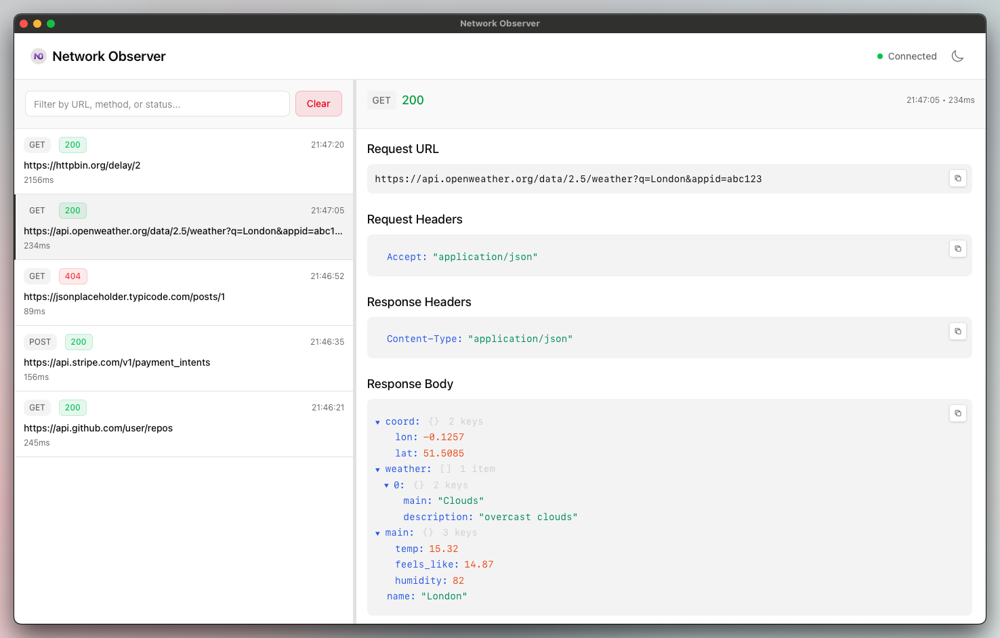

# Network Observer

A desktop application for monitoring network traffic from React Native apps during development. Built with Tauri v2, React 19, TypeScript, and Tailwind CSS v4.

*Vibe coded with Claude Code* ⚡



## Features

✨ **Real-time Network Monitoring** - View HTTP requests and responses as they happen
🔍 **Advanced Filtering** - Search by URL, method, status code
📊 **Request Details** - Headers, body, response data with syntax highlighting
🌙 **Dark Mode** - Manual toggle with system preference detection
📋 **Copy to Clipboard** - Copy URLs, headers, bodies with one click

## Quick Start

### 1. Install & Run Network Observer

```bash
# Clone and setup
git clone <repository>
cd network-observer
pnpm install

# Run in development
pnpm tauri dev

# Build for production
pnpm run build
```

### 2. Setup React Native App

Add the `useSetupNetworkObserver` hook to your React Native app. React Native has built-in WebSocket support, so no additional dependencies needed.

**Installation**: Just add the hook file to your project and use it in App.tsx:

```tsx
// App.tsx
import { useSetupNetworkObserver } from 'hooks/useNetworkObserver';

export default function App() {
  useSetupNetworkObserver(); // Add this one line

  // Your existing app code
  return (
    // Your app components
  );
}
```

The hook automatically:
- Intercepts fetch/XMLHttpRequest calls in development mode only
- Connects to `localhost:8085` (iOS) or `10.0.2.2:8085` (Android emulator)
- Sends network data in real-time to Network Observer

### 3. Start Monitoring

1. Launch Network Observer desktop app
2. Run your React Native app with network interception
3. Look for "Connected" status in the top right
4. Make network requests - they'll appear in real-time

**For Screenshots/Testing**: Click "Load Mock Data" button when no connection is active to see sample requests.

## Development

### Tech Stack
- **Tauri v2** - Cross-platform desktop framework
- **React 19** - Latest React with concurrent features
- **TypeScript** - Type safety
- **Tailwind CSS v4** - Utility-first CSS
- **WebSocket** - Real-time communication
- **Vite** - Build tool

### Development Commands
```bash
# Development
pnpm tauri dev          # Run desktop app in dev mode
pnpm dev               # Run web version only

# Code Quality
pnpm lint              # ESLint check
pnpm lint:fix          # Auto-fix lint issues
pnpm format            # Format code with Prettier
pnpm format:check      # Check formatting

# Build
pnpm run build         # Build web assets
pnpm tauri build       # Build desktop app
```

### Architecture

```
React Native App → WebSocket (port 8085) → Network Observer → Display
```

## Configuration

- **WebSocket Port**: 8085 (default)
- **Theme**: Auto-detects system preference
- **Storage**: In-memory only (no persistence)

## Troubleshooting

**"Waiting for connections..." persists**
- Ensure React Native app is running with network interception
- Check that both apps are on the same network
- Verify firewall isn't blocking port 8085

**Network requests not appearing**
- Confirm network interception is active in development mode
- Check WebSocket connection status
- Verify the hook is properly integrated

**Android connection issues**
- Use `10.0.2.2` instead of `localhost` for Android emulator
- For physical devices, use your computer's local IP address

## Contributing

1. Fork the repository
2. Create your feature branch (`git checkout -b feature/amazing-feature`)
3. Run the linter (`pnpm lint`)
4. Commit your changes (`git commit -m 'Add amazing feature'`)
5. Push to the branch (`git push origin feature/amazing-feature`)
6. Open a Pull Request

## License

This project is licensed under the MIT License.
